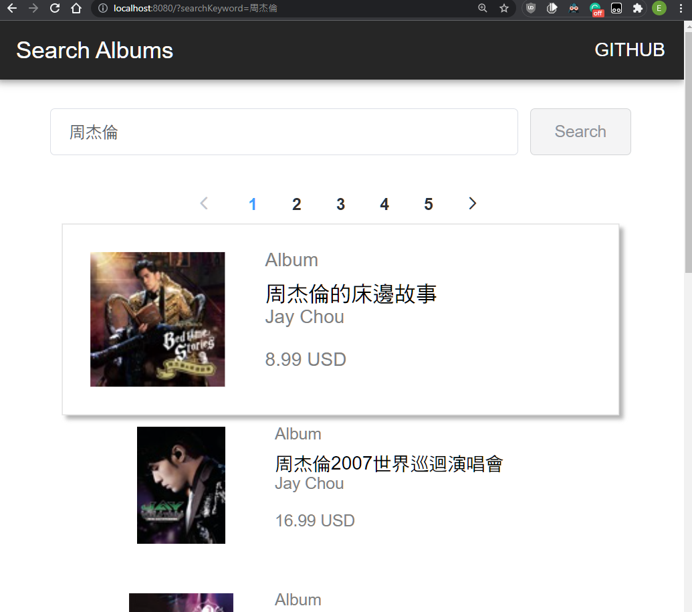

# vue3-itunes

Search iTunes albums.

<p align="center">
  
</p>

- Vue 3 Composition API + TypeScript
- Vue Router 4
- Element Plus
- Vuex 4
- Display search result depend on route query. For browser history and convenient sharing URL.
- Pagination
- Loading notification by using Vuex
- Scale transition on hover

## Project setup

```
yarn install
```

### Compiles and hot-reloads for development

```
yarn serve
```

### Compiles and minifies for production

```
yarn build
```

### Lints and fixes files

```
yarn lint
```

### Customize configuration

See [Configuration Reference](https://cli.vuejs.org/config/).
